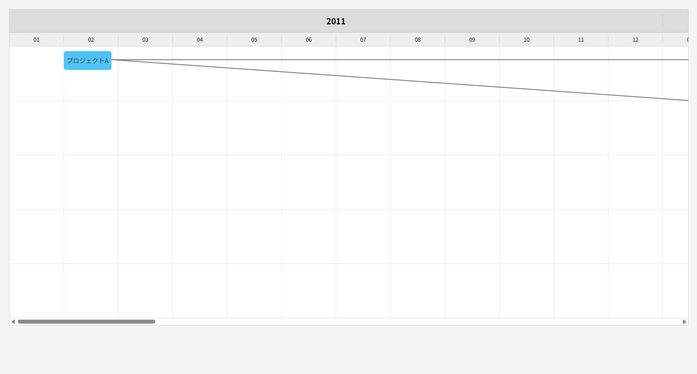

# Timeline Generator

タイムライン上にプロジェクトの開始・終了期間と、それらの関連を可視化できる軽量なJavaScriptライブラリです。  
年月単位でプロジェクトの流れを表現し、成長や派生を視覚的に分かりやすく表示できます。

---

## 特徴

- 年・月単位のグリッドに沿った正確なタイムライン表示
- プロジェクトノードの開始～終了期間を自動配置
- プロジェクト同士の接続（矢印線）描画機能
- スクロール対応済み（スクロール外でも線が正しく描画）
- HTML＋SCSS＋JavaScript のシンプル構成
- カスタマイズしやすい

---

## デモイメージ

  

---

## セットアップ

### 必要ファイル構成

```
/project-directory/
├── index.html
├── timeline.css
└── timeline.js
```

### 読み込み例

```html
<link rel="stylesheet" href="timeline.css">
<script src="timeline.js"></script>
```

---

## 使い方

### HTML側

```html
<div id="timeline-container">
    <div id="timeline-years" class="timeline-section timeline-years"></div>
    <div id="timeline-months" class="timeline-section timeline-months"></div>
    <div id="timeline-grid" class="timeline-section timeline-grid"></div>
</div>
```

### JavaScript側

```javascript
const timeline = new TimelineGenerator({
    targetId: "timeline-container",
    startDate: "2011-01",
    endDate: "2015-12",
    scale: "month",
    projects: [
        { id: "p1", name: "プロジェクトA", start: "2011-02", end: "2011-06", lane: 1, color: "#4fc3f7" },
        { id: "p2", name: "プロジェクトB", start: "2012-05", end: "2013-03", lane: 2, color: "#81c784" },
        { id: "p3", name: "プロジェクトC", start: "2013-08", end: "2014-04", lane: 1, color: "#ffb74d" }
    ],
    links: [
        { from: "p1", to: "p2" },
        { from: "p2", to: "p3" },
        { from: "p1", to: "p3" }
    ]
});
timeline.render();
```

---

## オプション一覧

| オプション | 必須 | 説明 |
|:---|:---|:---|
| targetId | 必須 | タイムラインを描画する対象divのID |
| startDate | 必須 | 開始年月 (`"YYYY-MM"` 形式)、日単位の場合は `"YYYY-MM-DD"`、年単位の場合は `"YYYY"` |
| endDate | 必須 | 終了年月 (`"YYYY-MM"` 形式)、日単位の場合は `"YYYY-MM-DD"`、年単位の場合は `"YYYY"` |
| scale | 任意 | `"day"`, `"month"`, `"year"`（デフォルトは"month"） |
| projects | 必須 | プロジェクト情報配列（下記参照） |
| links | 任意 | プロジェクト間の接続線情報配列 |
| onProjectClick | 任意 | プロジェクトボックスがクリックされた時のコールバック |

---

## プロジェクト情報（projects）

各プロジェクトは次の形式で指定します。

```javascript
{
  id: "p1",         // ユニークなID
  name: "名前",      // 表示名
  start: "2011-02", // 開始年月（dayの場合は"YYYY-MM-DD"、yearの場合は"YYYY"）
  end: "2011-06",   // 終了年月（dayの場合は"YYYY-MM-DD"、yearの場合は"YYYY"）
  lane: 1,          // レーン番号（上から順番に）
  color: "#4fc3f7"  // 任意：ボックスの色
}
```

### クリックイベントのコールバック

プロジェクトボックスにクリックイベントをバインドしたい場合は `onProjectClick` を指定します。

```javascript
const timeline = new TimelineGenerator({
  targetId: "timeline-container",
  startDate: "2011-01",
  endDate: "2015-12",
  scale: "month",
  projects,
  links,
  onProjectClick: ({ event, project, element }) => {
    console.log("Clicked", project, element);
    event.preventDefault();
  },
});
```

---

## 接続線情報（links）

プロジェクト間の関連を示す矢印線を設定します。

```javascript
{
  from: "p1", // 接続元プロジェクトID
  to: "p2"    // 接続先プロジェクトID
}
```

---

## 注意点

- **timeline.scss** を使う場合、必ずCSSにコンパイルしてから読み込んでください。
- コンテナ要素（例：`#timeline-container`）は **`position: relative;`** を指定してください。
- **年（50px）＋月（30px）**の固定ヘッダー高さを基準に線を描画しています（カスタマイズする場合はコード側も調整してください）。

---

## ライセンス

MIT License

---

## 作者

- Timeline Generator 開発者
- お問い合わせ：[ここに連絡先やGitHubアカウントなどを記載可能]
